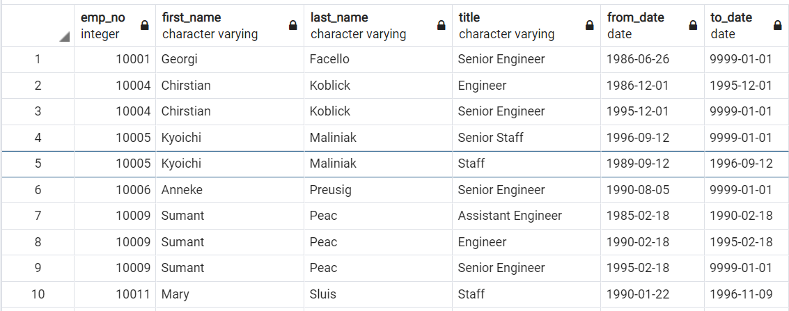
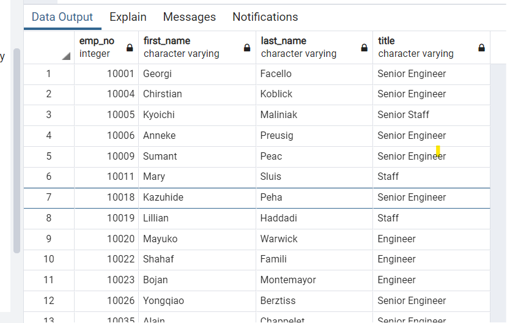
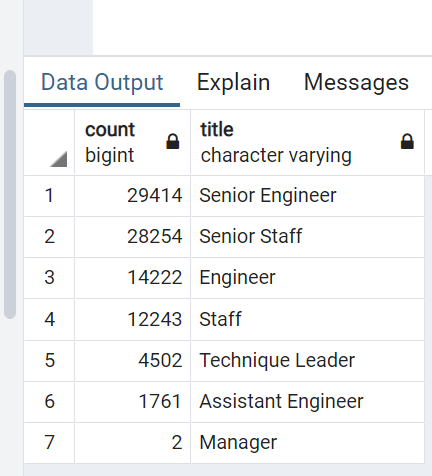
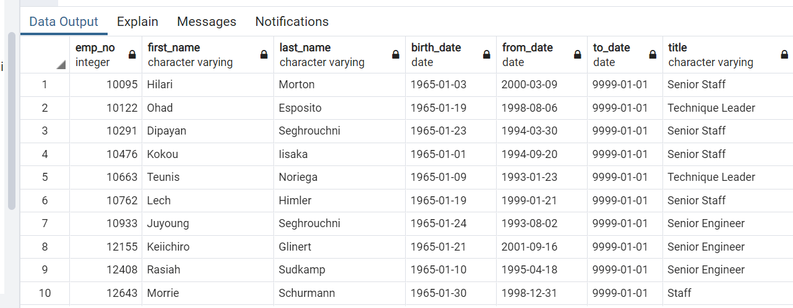

# Pewlett-Hackard-Analysis

# Overview of the analysis

After successful works related to SQL on a similar project, we have been assigned the task to write a report that summarizes the analysis and helps prepare the “silver tsunami” for the manager as many current employees reach retirement age.

The two main objectives of the analysis are as follows:

1. Determine the number of retiring employees per title;
2. Identify employees who are eligible to participate in a mentorship program.

# Results

The analysis showed 4 different results highlighted in bullet points with specific graphics below.

* Number of Retiring employees by their title

The retirement titles table above holds all the titles of current employees who were born between January 1, 1952 and December 31, 1955. The table also contains the most recent job title of each employee. The raw numbers is 133,776 total retirement retirement titles.

* Table retrieving most recent titles

There are duplicate entries for some employees because they have switched titles over the years. The unique titles table above helps in keeping only those with most recent titles and still working for the company which are about 90,398 employees.

* Table with employees about to retire

After the assessment of the most recent job titles of employees, the additionnla extrapolation was to pull out employees who are about to retire absed on their unique titles. The retiring titles above captures that information with nearly 90,398 employees on the verge of retirement.

In nnumbers, the table show that 29414 Senior Engineer and 28254 Senior Staff are about to retire. It's a silver tsunami, indeed.

* Mentorship eligibility table

The mentorship eligibilty table above holds the current employees who were born between January 1, 1965 and December 31, 1965. The total number is 1,549 employees eligible for mentorship.

# Summary

Provide high-level responses to the following questions, then provide two additional queries or tables that may provide more insight into the upcoming "silver tsunami."
1. How many roles will need to be filled as the "silver tsunami" begins to make an impact?
     * 90,398 roles must be filled before the "silver tsunmai" begins.

2. Are there enough qualified, retirement-ready employees in the departments to mentor the next generation of Pewlett Hackard employees?
      * From the numbers, only 1,549 retirement ready employees are abilable to mentor the new generation. This is only 2% which is far less, currently.

New data and table can be drawn in the future for clarity. For example, with time, a table capturing only titles. We do know that the the company has only 7 unique titles with 443,308 employees based on the titles tables creaed early. By narrowing the data, a table for retiring age and retiring year is usefull for the manager for proper planning and will be provided later on.
